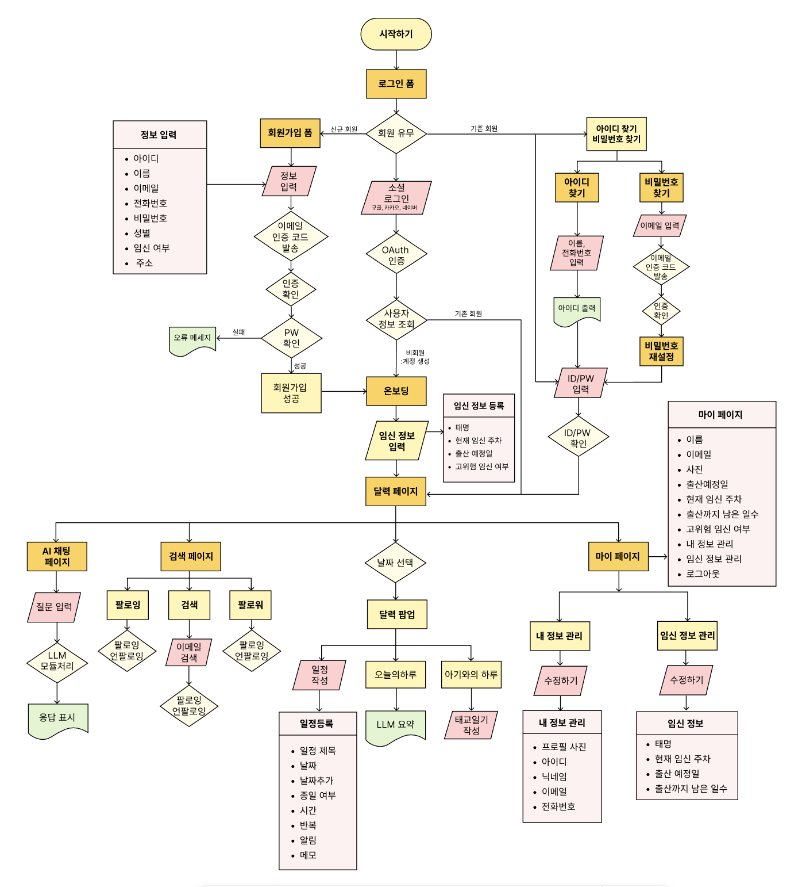
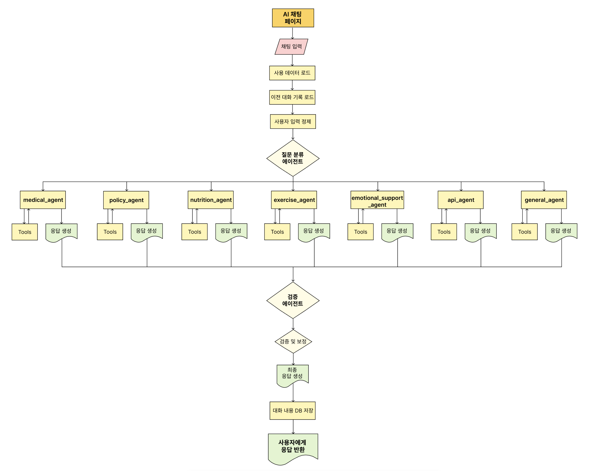
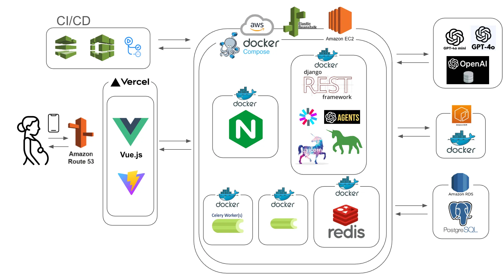
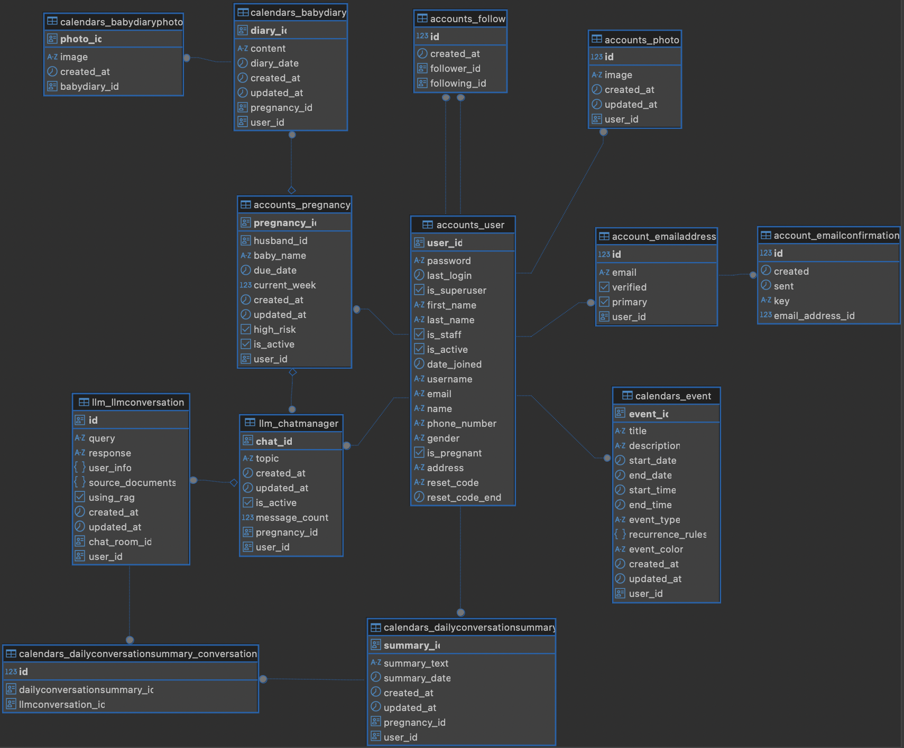

# 🌙 누리달: AI 기반 산전 관리 시스템


[➡️ 누리달 홈페이지 바로가기](https://www.nooridal.com/)

---

## 💁🏻‍♀️ 프로젝트 소개

## 🌙 누리달: AI 기반 산전 관리 시스템

## 프로젝트 개요

>대한민국의 일부 지역, 특히 **서울 이외의 소도시에서는 산부인과 의료 접근성이 낮아** 임산부들이 적절한 산전 및 산후 관리를 받기 어려운 현실입니다.  
또한, **미성년 임산부들은 사회적 편견과 경제적 어려움**으로 인해 필요한 의료 지원과 상담을 충분히 받지 못하고 있습니다.

>누리달은 이러한 문제를 해결하고자 **AI 기반 산전 관리 시스템**을 개발하여,  
**의료 정보 제공, 맞춤 건강 관리, 정부 지원 정책 안내**를 통해 **임산부와 신생아의 건강을 증진**하는 것을 목표로 합니다.

## 주요 목표

>1. **의료 접근성 향상**
>
> - AI 에이전트를 활용한 **철저하게 검증된 맞춤형 의료 정보 제공**
> - 신뢰할 수 있는 건강 관리 정보로 **임산부의 모성 건강 증진**

>2. **정부 지원 정책 제공**
>
>- **임산부를 위한 지원 정책**을 쉽고 간편하게 검색
>   - 거주 지역 기반으로 **맞춤형 정책 정보 추천**

>3. **개인 맞춤 건강 관리**
>
>- **AI 분석을 통한 임산부 개개인의 건강 상태 관리**
>- 정기적인 건강 체크 및 **맞춤형 케어 솔루션 제공**
<br>

## 기대 효과

<br><br>

### "누리달은 단순한 AI 기반 시스템이 아닌, **대한민국에서 태어나는 소중한 생명**을 지키고자 합니다."

<br><br>

---
## 🔗 GitHub Link

[nooridal-FE](https://github.com/YoonMooYeol/Florence_project_FE.git)  

[nooridal-BE](https://github.com/YoonMooYeol/Florence_project.git)  

<br><br>

---
## 👥 협업방식

<br>

> ### ✅ **프로토 타입 제작**
>
> 원하는 기능이 있다면 기능 추가 전 프로토타입을 제작하고, 튜터 및 팀원들과 사용성과 필요성을 검토한 후 도입 여부 결정하기
>
>### ✅ **빠르고 적극적인 피드백**
>
>개발 진행 중 발생하는 문제나 아이디어에 대해 빠르게 공유하고, 즉각적인 피드백을 주고받아 개선점을 빠르게 반영하기
>
>### ✅ **정기적인 회의**
>
>회의 시간을 정해서 (아침, 저녁) 아침에는 할 일에 대해 논의하고 저녁에는 체크하는 시간 갖기
>
>### ✅ **원활한 일정 관리**
>
>각자 주요 역할과 업무를 정하고, 팀원들과 주간 혹은 격주 단위로 진행 상황을 점검하며 유연하게 일정 조정하며 업무 효율을 극대화 하기
>
>### ✅ **문서화 작업**
>
>SA문서를 하루 단위로 만들어서 버전 관리
>
>### ✅ **버전 관리 시스템 활용**
>
>Git을 활용해 각자 브랜치를 생성해 코드 버전을 관리하고, 협업 시 충돌을 방지하기  

<br><br>

---
## 🔗 기술 스택

<br>


- 웹 서버: Django + Gunicorn + Nginx
- 비동기 작업: Celery + Celery Beat
- 메시지 브로커: Redis
- 데이터베이스: PostgreSQL
- 배포: Docker, Docker Compose, AWS Elastic Beanstalk

<br><br>

---
## ⚙️ 로컬 개발 환경 설정

<br>

### 사전 요구사항

- Docker 및 Docker Compose
- Python 3.12 이상 설치

### 환경 변수 설정

- `.env.example` 파일을 `.env`로 복사
- `.env` 파일의 환경 변수 값을 적절히 수정

### 로컬 실행 방법

```bash
# Docker Compose로 모든 서비스 실행
docker-compose up -d

# 로그 확인
docker-compose logs -f
```

<br><br>


---
## 📂 프로젝트 구조

<br>

```
Florence_project/
├── backend/                  # 백엔드 디렉토리
│   ├── config/               # 프로젝트 설정
│   ├── api/                  # API 앱
│   ├── users/                # 사용자 관리 앱
│   ├── ai_services/          # AI 관련 서비스
│   └── manage.py             # Django 관리 스크립트
├── frontend/                 # 프론트엔드 디렉토리
│   ├── public/               # 정적 파일
│   ├── src/                  # Vue 소스 코드
│   │   ├── assets/           # 이미지, 폰트 등
│   │   ├── components/       # Vue 컴포넌트
│   │   ├── views/            # 페이지 컴포넌트
│   │   ├── router/           # Vue Router 설정
│   │   ├── store/            # Vuex/Pinia 상태 관리
│   │   ├── services/         # API 호출 서비스
│   │   ├── App.vue           # 루트 컴포넌트
│   │   └── main.js           # 진입점
│   └── package.json          # npm 설정
├── .env                      # 환경 변수
├── .gitignore                # Git 제외 파일
└── requirements.txt          # Python 의존성
```

<br><br>

---
## 🌊 Process Flow

<br>

### 1️⃣ 전체 플로우



<br><br>

---
### 2️⃣ AI agent 플로우



<br><br>

---
## 🦾 Service Architecture



<br><br>

---
## 💾 ERD (Entity Relationship Diagram)



<br><br>

---
## 👩🏻‍💻 성과 및 회고  

<br>

## 잘된 점

### 맞춤형 AI 에이전트 `플로렌스` 구축

- 태명, 임신 주차, 고위험 임신 여부 및 사용자 컨디션 등 다양한 정보를 바탕으로 사용자 개개인에게 최적화된 정보를 제공
- 대화 중 사용자가 추가하고 싶은 일정이 있을 경우 에이전트가 자동으로 일정을 등록하여 편의성 향상
- 감성적이고 공감 능력이 뛰어난 에이전트를 구현하여 정서적 지원 제공

### 에이전트 - 캘린더 연동 서비스 구현

- 사용자가 에이전트와 대화한 내용을 자동 요약하여 일별로 정리, 임신 과정의 중요한 순간을 체계적으로 관리 가능
- 캘린더 탭에서 LLM 대화, 태교 일기, 일정 관리 등 핵심 기능을 통합적으로 관리

<br><br>

---
## 아쉬운 점

### 에이전트 정보 제공 한계

- 현재 정부나, 지자체에서 정리중인 산부인과는 운영을 안하거나, 전화를 안받는 경우가 많았음.(정보가 매우 부정확함))
- 거주 지역을 기준으로 주변의 분만실 보유 산부인과 혹은 난임전문병원을 추천하고자 했으나, AI 에이전트가 최신 정보를 제대로 반영하지 못함

### 달력 UX 완성도 개선 필요

- 반복 일정을 화면에 렌더링하는 과정에서 약간의 시간 지연 발생
- Fullcalender는 장기일정에 대해 마지막날을 exclusice함.
- 일정 표시와 관련된 UI 개선 필요

### 알림 시스템 미구현

- 주요 일정에 대한 푸시 알림 기능을 개발 일정 내에 구현하지 못함

<br><br>

---
## 향후 계획

### 정확한 최신 정보 제공 체계 구축

- 의료 전문가 검수 시스템을 도입하여 건강 정보의 신뢰성 향상
- 정부 기관과 협업하여 정책 및 병원 정보를 제공하는 시스템 구축
- 네이버맵/카카오맵 등의 국내 지도 API를 활용하여 에이전트가 병원 관련 최신 데이터를 검색할 수 있도록 개선

### 추가 기능 구현

- **달력과 채팅의 상호협력관계 UXUI 개선**
  - 달력의 모든 기능을 에이전트가 활용하여 일정관리를 할 수 있도록 함
  - 사용자 설정에 맞춘 일정 자동 등록 ex) 회사일정은 파란색, 개인일정은 노란색 
<br>
- **알림 시스템 구축**
  - 오전, 오후 사용자에게 인사를 건네는 친근한 알림 기능
  - 주요 일정에 대한 리마인더 기능

## 🫧 문제 해결

문제가 발생할 경우 프로젝트 [관리자](https://github.com/YoonMooYeol) 에게 문의하세요.
